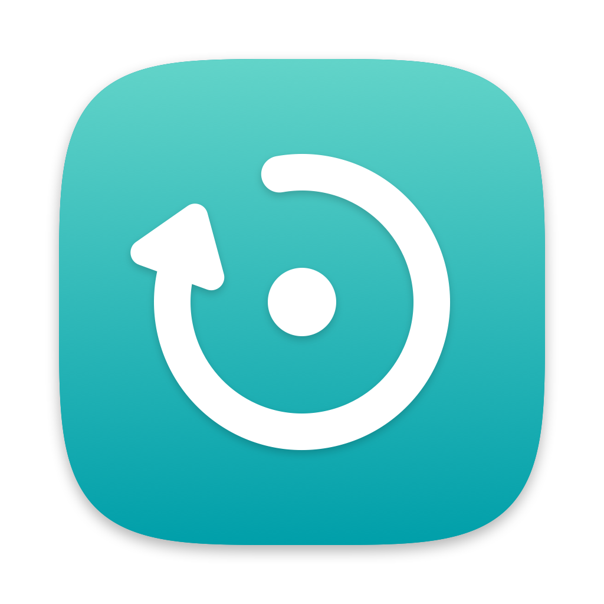

<p align="center">
  
</p>

<h1 align="center">KeepAlive</h1>

<p align="center">
  Hält selbst entwickelte iOS-Apps auf deinem iPhone installiert, ohne kostenpflichtigen Developer Account.<br>
  <a href="README.md">English</a>
</p>

---

Apps, die mit einem kostenlosen Apple Account signiert sind, lassen sich nach sieben
Tagen nicht mehr öffnen. KeepAlive ist eine kleine Menüleisten-App für deinen Mac, die
sie vorher neu baut und installiert, sobald dein iPhone im selben WLAN ist.

- Baut von jedem ausgewählten Projekt die **Release**-Konfiguration.
- Erneuert frühzeitig, standardmäßig ab drei Tagen. So bleiben vier Tage Puffer.
- Installiert über WLAN oder Kabel mit Apples eigenen Werkzeugen (`xcodebuild` und `devicectl`).
- Spart Energie. macOS plant die Prüfungen ein, und Builds warten auf das Netzteil,
  außer eine App läuft innerhalb eines Tages ab.
- Funktioniert mit Swift-, Objective‑C-, Flutter- und React-Native-Projekten.

## Voraussetzungen

- macOS 14 Sonoma oder neuer
- Xcode 15 oder neuer, mit deinem Apple Account angemeldet
- Ein iPhone oder iPad mit aktiviertem Entwicklermodus

## Installation

Lade `KeepAlive.zip` aus dem [neuesten Release](../../releases/latest), entpacke es und
bewege KeepAlive in den Ordner „Programme“.

KeepAlive ist nicht notarisiert, weil dafür ein kostenpflichtiger Developer Account nötig
ist. Klicke die App beim ersten Mal mit gedrückter ctrl-Taste an, wähle **Öffnen** und
bestätige. Alternativ geht es im Terminal:

```sh
xattr -dr com.apple.quarantine /Applications/KeepAlive.app
```

Selbst bauen:

```sh
git clone https://github.com/oli-zr/KeepAlive.git
cd KeepAlive
scripts/build_app.sh
open build/KeepAlive.app
```

## Einrichtung

Das ist nur einmal nötig.

1. **Anmelden:** In Xcode unter Settings → Accounts deinen Apple Account hinzufügen.
2. **WLAN-Kopplung:** Das iPhone per Kabel anschließen. In Xcode Window → Devices and
   Simulators wählen, das iPhone auswählen und **Connect via network** aktivieren.
3. **Projekt vorbereiten:** Das Projekt einmal in Xcode öffnen. Unter Signing &
   Capabilities **Automatically manage signing** und dein Personal Team wählen, dann
   einmal auf dem iPhone ausführen.
4. **In KeepAlive hinzufügen:** Auf das KeepAlive-Symbol in der Menüleiste klicken und
   Einstellungen → Apps → App hinzufügen … wählen.

Bei Flutter-Projekten unter **Vor dem Build** `flutter build ios --release --config-only`
eintragen.

## Grenzen

Diese Grenzen setzt Apple für kostenlose Accounts, nicht KeepAlive.

- Höchstens drei eigene Apps gleichzeitig pro Gerät.
- Höchstens zehn neue App-IDs innerhalb von sieben Tagen.
- Manche Funktionen wie Push-Mitteilungen oder iCloud sind nicht verfügbar.
- Dein Mac muss alle paar Tage wach und im selben Netzwerk wie dein iPhone sein.

## Lizenz

MIT, siehe [LICENSE](LICENSE).

KeepAlive ist ein unabhängiges Projekt und steht in keiner Verbindung zu Apple Inc.
Xcode, iPhone und macOS sind Marken der Apple Inc.
