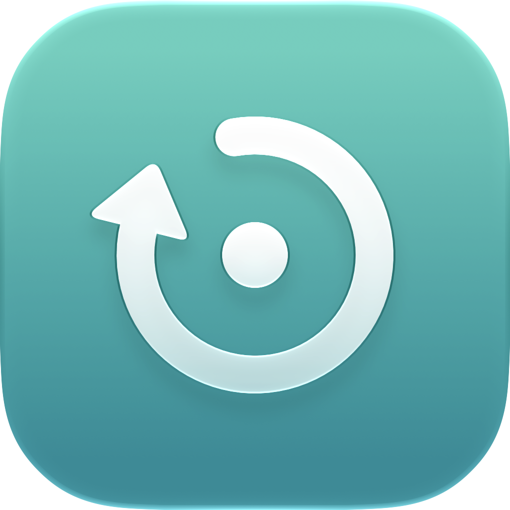
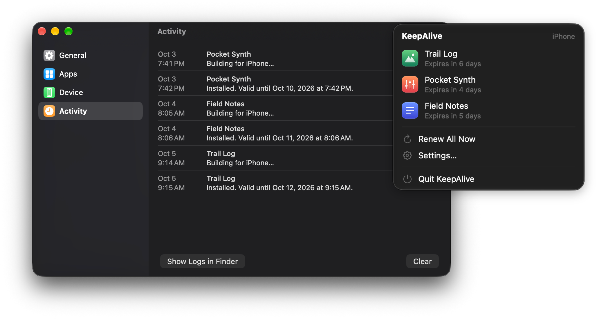

<p align="center">
  
</p>

<h1 align="center">KeepAlive</h1>

<p align="center">
  Keeps the iOS apps you build yourself installed on your iPhone, without a paid developer account.<br>
  <a href="README.de.md">Deutsch</a>
</p>

<p align="center">
  
</p>

Apps signed with a free Apple Account stop opening after seven days. KeepAlive is a
small menu bar app for your Mac that rebuilds and reinstalls them before that happens,
whenever your iPhone is on the same Wi‑Fi network.

- Builds the **Release** configuration of each project you choose.
- Renews early, by default once an app is three days old, so there are four days of buffer.
- Installs over Wi‑Fi or a cable using Apple’s own tools (`xcodebuild` and `devicectl`).
- Uses little energy. macOS schedules the checks, and builds wait for a power adapter
  unless an app expires within a day.
- Works with any Xcode project or workspace. Projects made with Flutter or other
  cross-platform tools can run a command before each build.
- Leaves no build files behind once an app is installed.
- Available in English and German.

## Requirements

- macOS 14 Sonoma or later
- Xcode 15 or later, signed in with your Apple Account
- An iPhone or iPad with Developer Mode turned on

## Installation

Download `KeepAlive.zip` from the [latest release](../../releases/latest), unzip it, and
move KeepAlive to your Applications folder.

KeepAlive is not notarized, because that requires a paid developer account, so macOS
blocks it the first time you open it. Open System Settings → Privacy & Security, scroll
down, and click **Open Anyway** next to the message about KeepAlive. You can also run:

```sh
xattr -dr com.apple.quarantine /Applications/KeepAlive.app
```

To build it yourself (requires Xcode 26 or later):

```sh
git clone https://github.com/oli-zr/keepalive.git
cd keepalive
scripts/build_app.sh
open build/KeepAlive.app
```

### Verifying a download

Every release is built by GitHub Actions from the tagged source code, and GitHub signs a
record of that build. With the [GitHub CLI](https://cli.github.com) you can confirm that a
download came from this repository and was not changed afterwards:

```sh
gh attestation verify KeepAlive.zip --repo oli-zr/keepalive
```

## Setup

You only need to do this once.

1. **Sign in.** In Xcode, open Settings → Accounts and add your Apple Account.
2. **Pair over Wi‑Fi.** Connect your iPhone with a cable. In Xcode, choose Window →
   Devices and Simulators, select your iPhone, and turn on **Connect via network**.
3. **Prepare each project.** Open it in Xcode once. Under Signing & Capabilities, select
   **Automatically manage signing** and your Personal Team, then run it on your iPhone.
   The first time, your iPhone asks you to trust your developer certificate in
   Settings → General → VPN & Device Management.
4. **Add it to KeepAlive.** Click the KeepAlive icon in the menu bar and choose
   Settings… → Apps → Add App…
5. **Keep KeepAlive running.** Turn on **Open at Login** under General. If more than one
   device is paired, choose your iPhone under Device.

For Flutter projects, enter `flutter build ios --release --config-only` under
**Before Build**, so the iOS project is up to date before each build.

## How it works

Every 30 minutes, at a time macOS considers convenient, and after your Mac wakes,
KeepAlive checks whether an app is due. For each app that is due, it:

1. Looks for your iPhone with `devicectl`.
2. Removes Xcode’s cached provisioning profile for that app, so Apple issues a new one
   that is valid for seven days.
3. Builds the Release configuration with `xcodebuild -allowProvisioningUpdates`.
4. Installs the app with `devicectl device install app`. Your data in the app is kept.
5. Deletes the build files. Nothing is added to your project folder.

Settings are stored in `~/Library/Application Support/KeepAlive`, and logs in
`~/Library/Logs/KeepAlive`. Together they take up less than a megabyte.

## Updates

KeepAlive checks GitHub once a day and installs new versions by itself while no app is
being built, then restarts. The download is checked against the checksum published with
each release. You can turn this off under General → Updates, or check manually there.
Versions before 1.1 cannot update themselves; replace them once by hand.

## Limitations

These are limits Apple sets for free accounts, not limits of KeepAlive.

- At most three of your own apps can be installed on a device at the same time.
- At most ten new app IDs can be created in seven days.
- Some capabilities, such as push notifications or iCloud, are not available.
- Your Mac needs to be awake and on the same network as your iPhone at least once
  every few days.

## License

MIT. See [LICENSE](LICENSE).

KeepAlive is an independent project and is not affiliated with or endorsed by Apple Inc.
Xcode, iPhone and macOS are trademarks of Apple Inc.
